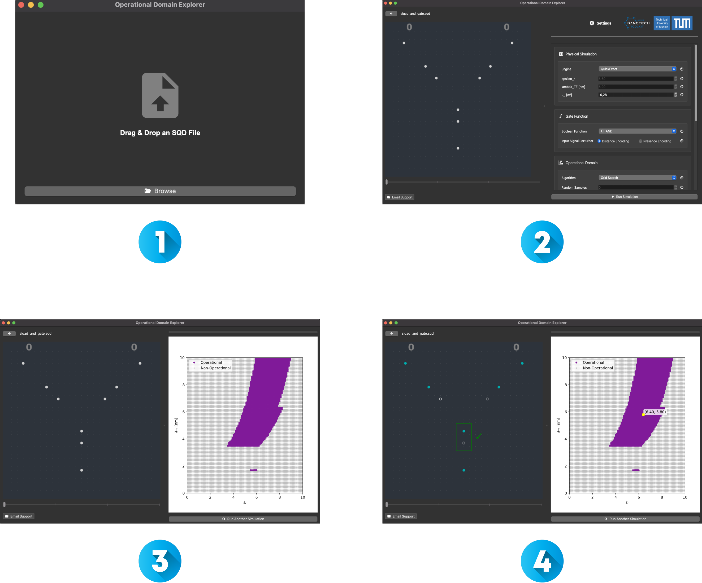

[](https://github.com/cda-tum/mnt-opdom-explorer/actions)
[](https://github.com/cda-tum/mnt-opdom-explorer/actions/workflows/ci.yml)
[](https://codecov.io/gh/cda-tum/mnt-opdom-explorer)
[](https://github.com/cda-tum/mnt-opdom-explorer/blob/main/LICENSE)
[](https://dl.acm.org/doi/10.1145/3611315.3633246)

# **Operational Domain Explorer**

> [!Important]
> This project is still in the early stages of development. We appreciate your patience and understanding as work to improve the GUI continues.

<p align="center">
  <picture>
    <source media="(prefers-color-scheme: dark)" srcset="https://raw.githubusercontent.com/cda-tum/fiction/main/docs/_static/mnt_light.svg" width="60%">
    
  </picture>
</p>

The _Operational Domain Explorer_ is a PyQt6 application that enables insight into the robustness of
_Silicon Dangling Bond_ (SiDB) gates against material imperfections at the atomic scale. To this end, it relies on
physical simulation tools implemented in the [_fiction_ framework](https://github.com/cda-tum/fiction). The Operational
Domain Explorer is developed as part of the _Munich Nanotech Toolkit_ (_MNT_) by
the [Chair for Design Automation](https://www.cda.cit.tum.de/) at
the [Technical University of Munich](https://www.tum.de/).

## 📊 **Operational Domain Analysis**

The _Operational Domain_ was proposed as a methodology to evaluate the extent of physical parameter variations that an
SiDB logic gate can tolerate by plotting the logical correctness of that gate's behavior across a predetermined range of
physical parameters. Given an SiDB layout _L_ and a Boolean function $f : \mathbb{B}^{n} ⟼ \mathbb{B}^{m}$, the operational domain of _L_ given
_f_ is defined in the parameter space as the set of coordinate points for which _L_ implements _f_. To determine whether
_L_ implements _f_ at any given coordinate point _(x, y, z)_, this point can be sampled, i.e., by conducting _2ⁿ_
physical simulations—one for each possible input pattern of _L_.

## 🚀 **Getting Started**

### 📥 Step 1: Clone the Repository

First, clone the repository to your local machine using Git:

```bash
git clone https://github.com/cda-tum/opdom-explore.git
cd opdom-explore
```

### 🖥️ Step 2: Running the Application

First, make sure to install [uv](https://github.com/astral-sh/uv).

```bash
pip install uv
```

Second, to start the _Operational Domain Explorer_, run the application as follows:

```bash
cd src/mnt/opdom_explorer/
uv run main.py
```

### ✅ Step 3: Running Tests

1. Run the tests:

   ```bash
   uvx nox -s tests --verbose
   ```

### 🌌 Step 4: How to explore your first Operational Domain

<p align="center">
  <picture>
    
  </picture>
</p>

### 📜 **Workflow Overview**

1. **📂 Load SQD File:**
   Begin by loading an SiDB gate as an SQD file. Extensive gate libraries are available in the open-source project [_fiction_](https://github.com/cda-tum/fiction/tree/main/experiments/sidb_gate_libraries). Alternatively, you can use gates designed in tools like [_SiQAD_](https://github.com/siqad/siqad). It is crucial to ensure that the input and output cells are correctly specified in the SQD file. To be precise, `<type>input</type>` for input cells and `<type>output</type>` for output cells must be present in the SQD file directly below the `<latcoord n="..." m="..." l="..."/>` tag of the respective SiDBs.

2. **⚙️ Configure the Operational Domain Simulation:**
   The _Operational Domain Explorer_ offers a wide range of parameters and settings to simulate operational domains for various scenarios. This step is divided into three sections: _Physical Simulation_, _Gate Function_, and _Operational Domain_.

   - **Physical Simulation**: Select a simulation engine. Currently, [_ExGS_](https://fiction.readthedocs.io/en/latest/algorithms/sidb_simulation.html#exhaustive-ground-state-simulation), [_QuickSim_](https://fiction.readthedocs.io/en/latest/algorithms/sidb_simulation.html#exhaustive-ground-state-simulation), and [_QuickExact_](https://fiction.readthedocs.io/en/latest/algorithms/sidb_simulation.html#exhaustive-ground-state-simulation) are available, with faster simulators in development.
   - **Gate Function**: Specify the Boolean function the gate is intended to implement. Supported functions include AND, OR, NAND, NOR, XOR, and XNOR, with more to be added soon.
   - **Operational Domain**: Define how the operational domain is simulated. Choose from _Grid Search_, _Random Sampling_, _Flood Fill_, or _Contour Tracing_ algorithms. Additionally, set the dimensions, range, and resolution of the operational domain. You can also configure whether to tolerate or reject kinks in the operational domain.

   Users can hover over the help icons to get more information.

3. **▶️ Run the Operational Domain Simulation:**
   Once the settings are configured, start the operational domain simulation. Note that simulation time can vary depending on the simulation engine, reconstruction algorithm, resolution, etc. High-effort simulation may take several minutes, whereas lower resolutions can be explored almost instantaneously. After the simulation is finished, the settings widget is replaced with a visual representation of the operational domain.

4. **🔍 Analyze the Results:**
   Analyze the operational domain by clicking the plot to gain insights into charge distribution at any parameter point and understand why the gate is operational or not. Blue, gray, and red represent negatively, neutrally, and positively charged SiDBs, respectively. Use the slider below the layout plot to explore the charge distribution for different input patterns. Note that if the gate is inoperable for any input pattern, it is considered inoperable overall. To aid in the analysis, the output binary-dot logic (BDL) pair is framed with a green or red rectangle to represent operational or non-operational behavior, respectively. In addition, if the gate is non-operational due to the presence of kinks, a red `⚡` symbol is displayed.

## 🤝 **Contributing**

If you're interested in contributing, feel free to fork the repository and submit pull requests. Make sure to follow the coding guidelines and run tests before submitting your PR.

## 📖 **Reference**

If you use the _Operational Domain Explorer_ for academic purposes, we would be thankful if you referred to it by citing the following publication:

```bibtex
@inproceedings{walter2023opdom,
    title={{Reducing the Complexity of Operational Domain Computation in Silicon Dangling Bond Logic}},
    author={Walter, Marcel and Drewniok, Jan and Ng, Samuel Sze Hang and Walus, Konrad and Wille, Robert},
    booktitle={International Symposium on Nanoscale Architectures (NANOARCH)},
}
```

---

## 📜 **License**

This project is licensed under the [Prosperity Public License 3.0.0](https://prosperitylicense.com/versions/3.0.0).

- **Permitted Use:** You are free to use this software for personal, academic, and other non-commercial purposes.
- **Prohibited Use:** Commercial use of this software is not permitted under this license. Any form of direct or
  indirect commercial exploitation is strictly prohibited without obtaining a commercial license first.

If you would like to obtain a commercial license to use this project in a business, product, or any profit-driven
environment, please reach out directly for licensing terms.

For further details, please refer to
the [LICENSE.md](https://github.com/cda-tum/mnt-opdom-explorer/blob/main/LICENSE.md) file in this repository.

---

## 🙏 **Acknowledgements**

The Munich Nanotech Toolkit has been supported by the Bavarian State Ministry for Science and Arts through the
Distinguished Professorship Program.

<p align="center">
    <picture>
        <source media="(prefers-color-scheme: dark)" srcset="https://raw.githubusercontent.com/cda-tum/mqt/main/docs/_static/tum_dark.svg" width="28%">
        
    </picture>
    &nbsp;&nbsp;&nbsp;&nbsp;&nbsp; <!-- Non-breaking spaces for spacing -->
    <picture>
        
    </picture>
</p>
